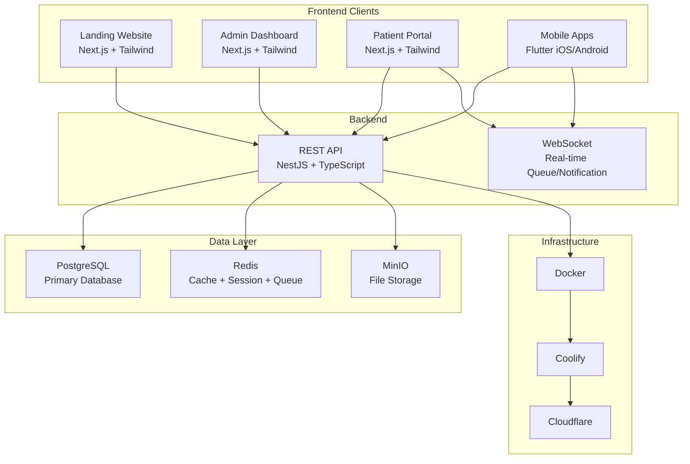
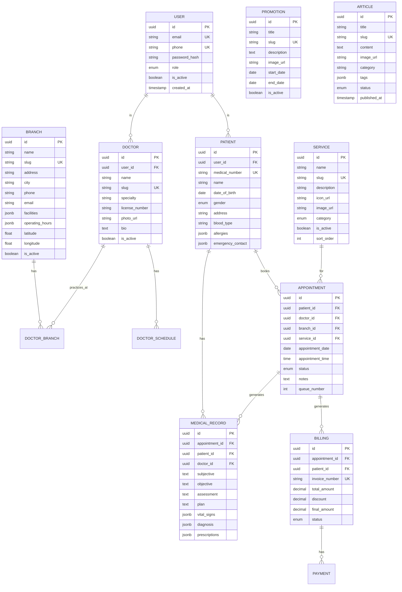
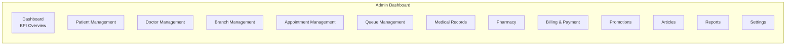

# Clinic Management System — Full-Stack Implementation Plan

Build the complete Clinic Management System ecosystem: Backend API, Landing Website, Admin Dashboard, Patient Portal, and prepare for Flutter mobile apps — all sharing one backend.

---

## Architecture Overview



## Tech Stack (Aligned with Product Vision)

| Layer | Technology | Purpose |
|-------|-----------|---------|
| **Frontend Web** | Next.js 15 (App Router) | Landing, Dashboard, Portal |
| **Language** | TypeScript | Type safety across all web apps |
| **Styling** | Tailwind CSS v4 | Utility-first CSS |
| **UI Components** | shadcn/ui | Consistent, accessible components |
| **Animation** | Framer Motion | Micro-animations & transitions |
| **Backend** | NestJS | Modular, scalable API |
| **Database** | PostgreSQL 16 | Primary relational database |
| **ORM** | Prisma | Type-safe database access |
| **Cache** | Redis | Session, cache, queue |
| **Storage** | MinIO | S3-compatible file storage |
| **Auth** | JWT + Refresh Token | Secure authentication |
| **Mobile** | Flutter | iOS & Android apps (Phase 5) |
| **Deployment** | Docker + Coolify | Container orchestration |
| **CDN** | Cloudflare | Performance & security |

---

## Phased Implementation

> [!IMPORTANT]
> The project is divided into 5 phases. Each phase builds on the previous one. I'll start building **Phase 1 (Backend) and Phase 2 (Landing Website) simultaneously** since they can be developed in parallel.

---

## Phase 1: Backend API (NestJS + PostgreSQL)

### Project Structure

```
clinic-api/
├── prisma/
│   ├── schema.prisma          # Database schema
│   ├── seed.ts                # Seed data
│   └── migrations/
├── src/
│   ├── main.ts
│   ├── app.module.ts
│   ├── common/                # Shared utilities
│   │   ├── guards/
│   │   ├── decorators/
│   │   ├── filters/
│   │   ├── interceptors/
│   │   ├── pipes/
│   │   └── dto/
│   ├── config/                # Configuration
│   ├── modules/
│   │   ├── auth/              # Authentication & Authorization
│   │   ├── users/             # User Management
│   │   ├── patients/          # Patient Management
│   │   ├── doctors/           # Doctor Management
│   │   ├── branches/          # Branch Management
│   │   ├── services/          # Clinic Services
│   │   ├── appointments/      # Appointment & Booking
│   │   ├── queue/             # Queue Management
│   │   ├── medical-records/   # EMR (SOAP)
│   │   ├── pharmacy/          # Pharmacy & Prescriptions
│   │   ├── laboratory/        # Lab Results
│   │   ├── billing/           # Invoice & Payment
│   │   ├── inventory/         # Stock Management
│   │   ├── promotions/        # Promotions & Campaigns
│   │   ├── articles/          # Blog/Articles
│   │   ├── notifications/     # Push, Email, WhatsApp
│   │   ├── reports/           # Analytics & Reporting
│   │   ├── settings/          # System Settings
│   │   ├── audit-log/         # Activity Logging
│   │   └── upload/            # File Upload (MinIO)
│   └── prisma/                # Prisma service
├── docker-compose.yml
├── Dockerfile
└── .env
```

### Database Schema (Core Tables)



### API Endpoints (Core)

| Module | Method | Endpoint | Description |
|--------|--------|----------|-------------|
| **Auth** | POST | `/api/auth/register` | Register patient |
| | POST | `/api/auth/login` | Login |
| | POST | `/api/auth/refresh` | Refresh token |
| | POST | `/api/auth/forgot-password` | Password reset |
| **Users** | GET | `/api/users/me` | Current user profile |
| | PATCH | `/api/users/me` | Update profile |
| **Branches** | GET | `/api/branches` | List all branches |
| | GET | `/api/branches/:slug` | Branch detail |
| **Doctors** | GET | `/api/doctors` | List doctors (filter/search) |
| | GET | `/api/doctors/:slug` | Doctor detail + schedule |
| **Services** | GET | `/api/services` | List services |
| | GET | `/api/services/:slug` | Service detail |
| **Appointments** | POST | `/api/appointments` | Create booking |
| | GET | `/api/appointments` | My appointments |
| | PATCH | `/api/appointments/:id` | Update/cancel |
| **Queue** | GET | `/api/queue/:branchId` | Live queue status |
| **Medical Records** | GET | `/api/medical-records` | Patient history |
| **Promotions** | GET | `/api/promotions` | Active promotions |
| **Articles** | GET | `/api/articles` | List articles |
| | GET | `/api/articles/:slug` | Article detail |
| **Admin** | Full CRUD | `/api/admin/*` | All management endpoints |

---

## Phase 2: Landing Website (Next.js)

### Project Structure

```
clinic-web/
├── src/
│   ├── app/
│   │   ├── layout.tsx              # Root layout
│   │   ├── page.tsx                # Home
│   │   ├── about/page.tsx
│   │   ├── services/
│   │   │   ├── page.tsx            # Service list
│   │   │   └── [slug]/page.tsx     # Service detail
│   │   ├── doctors/
│   │   │   ├── page.tsx            # Doctor list
│   │   │   └── [slug]/page.tsx     # Doctor detail
│   │   ├── branches/
│   │   │   ├── page.tsx            # Branch list
│   │   │   └── [slug]/page.tsx     # Branch detail
│   │   ├── promotions/
│   │   ├── articles/
│   │   ├── faq/page.tsx
│   │   ├── contact/page.tsx
│   │   ├── login/page.tsx
│   │   ├── register/page.tsx
│   │   └── globals.css
│   ├── components/
│   │   ├── layout/
│   │   │   ├── Navbar.tsx
│   │   │   ├── Footer.tsx
│   │   │   ├── Hero.tsx
│   │   │   ├── CTA.tsx
│   │   │   ├── AnnouncementBar.tsx
│   │   │   └── Breadcrumb.tsx
│   │   ├── cards/
│   │   │   ├── ServiceCard.tsx
│   │   │   ├── DoctorCard.tsx
│   │   │   ├── BranchCard.tsx
│   │   │   ├── PromotionCard.tsx
│   │   │   ├── ArticleCard.tsx
│   │   │   └── TestimonialCard.tsx
│   │   ├── sections/
│   │   │   ├── QuickBooking.tsx
│   │   │   ├── ServicesSection.tsx
│   │   │   ├── DoctorsSection.tsx
│   │   │   ├── BranchesSection.tsx
│   │   │   ├── PromotionsSection.tsx
│   │   │   ├── TestimonialsSection.tsx
│   │   │   ├── ArticlesSection.tsx
│   │   │   └── DownloadApp.tsx
│   │   └── ui/                     # shadcn/ui components
│   ├── lib/
│   │   ├── api.ts                  # API client
│   │   ├── utils.ts
│   │   └── constants.ts
│   └── hooks/
├── public/
│   ├── images/
│   └── icons/
├── tailwind.config.ts
├── next.config.ts
└── package.json
```

### Home Page Sections

All 13 sections per layout spec:

| # | Section | Content |
|---|---------|---------|
| 1 | Announcement Bar | Promo banner |
| 2 | Navbar | Sticky, transparent → solid on scroll |
| 3 | Hero | Headline + CTA + Doctor image + Trust badges |
| 4 | Quick Booking | Service/Doctor/Branch/Date selector |
| 5 | Services | 8 service cards in responsive grid |
| 6 | Doctors | Doctor cards with photo, specialty, schedule |
| 7 | Branches | Branch cards with map, hours, facilities |
| 8 | Promotions | Current promo cards |
| 9 | Testimonials | Patient review cards (carousel) |
| 10 | Articles | Latest health articles |
| 11 | Download App | App Store + Google Play badges |
| 12 | CTA | "Ready to Book?" conversion section |
| 13 | Footer | 5-column: Company, Navigation, Services, Contact, Social |

---

## Phase 3: Admin Dashboard

### Features



| Module | Description |
|--------|-------------|
| **Dashboard** | KPI cards, charts, real-time statistics |
| **Patient CRUD** | Register, edit, search, medical history |
| **Doctor CRUD** | Profile, schedule, branch assignment |
| **Branch CRUD** | Info, facilities, operating hours |
| **Appointment** | View, approve, reschedule, cancel |
| **Queue** | Real-time queue board, call next patient |
| **Medical Records** | SOAP form, diagnosis, prescriptions |
| **Pharmacy** | Prescription queue, stock management |
| **Billing** | Invoice generation, payment recording |
| **Promotions** | Create/edit campaigns |
| **Articles** | CMS for health articles |
| **Reports** | Revenue, patient visits, branch performance |
| **Settings** | Users, roles, permissions, system config |

---

## Phase 4: Patient Portal

| Feature | Description |
|---------|-------------|
| **Registration** | Account creation with OTP verification |
| **Login** | Email/phone + password |
| **Profile** | Personal info, medical history |
| **Booking** | Search doctor → select schedule → book |
| **Queue** | Live queue status |
| **History** | Past appointments, diagnoses, prescriptions |
| **Billing** | View invoices, payment history |
| **Notifications** | Appointment reminders, promo alerts |

---

## Phase 5: Flutter Mobile Apps (iOS & Android)

> [!NOTE]
> Flutter will consume the same NestJS API, ensuring data sync across all platforms. The UI component design tokens (color, typography, radius, shadow) are already defined in the spec with Flutter mappings.

| Feature | Description |
|---------|-------------|
| **Onboarding** | App intro screens |
| **Auth** | Login, register, biometric |
| **Home** | Services, doctors, promotions |
| **Booking** | Full appointment booking flow |
| **Queue** | Real-time queue with push notifications |
| **Medical** | Health records, prescriptions |
| **Profile** | Personal settings, family members |
| **Notifications** | FCM push notifications |

---

## Project Folder Structure

```
/Users/adibpurwanto/Downloads/Clinic/
├── 00-Product-Vision.md          # (existing)
├── 01-Sitemap.md                 # (existing)
├── 02-User-Flow.md               # (existing)
├── 03-Layout-Structure.md        # (existing)
├── 04-Landing-Website/           # (existing specs)
│
├── clinic-api/                   # [NEW] NestJS Backend
├── clinic-web/                   # [NEW] Next.js Landing Website
├── clinic-admin/                 # [Phase 3] Admin Dashboard
├── clinic-portal/                # [Phase 4] Patient Portal
└── clinic-mobile/                # [Phase 5] Flutter App
```

---

## Build Order

I will execute in this order:

### Step 1 — Backend Foundation
1. Initialize NestJS project (`clinic-api`)
2. Setup PostgreSQL with Docker Compose
3. Create Prisma schema with all core tables
4. Implement Auth module (register, login, JWT)
5. Implement core CRUD modules (branches, doctors, services, patients)
6. Seed database with sample clinic data
7. Setup Redis for caching

### Step 2 — Landing Website
1. Initialize Next.js project (`clinic-web`) with Tailwind CSS + shadcn/ui
2. Implement design system (colors, typography, spacing tokens)
3. Build layout components (Navbar, Hero, Footer, CTA)
4. Build all Home page sections (13 sections)
5. Build inner pages (About, Services, Doctors, Branches, etc.)
6. Connect to Backend API
7. SEO optimization

### Step 3 — Admin Dashboard
1. Initialize Next.js project (`clinic-admin`)
2. Auth + Role-based access (Admin, Doctor, Nurse, Pharmacist, Cashier)
3. Dashboard with KPI charts
4. All CRUD management modules
5. Real-time queue board

### Step 4 — Patient Portal
1. Patient auth flow with OTP
2. Booking flow
3. Queue tracking
4. Medical history viewer

### Step 5 — Flutter Mobile
1. Initialize Flutter project
2. Shared design system (tokens already defined)
3. Implement all patient-facing features

---

## Open Questions

> [!IMPORTANT]
> **Nama Klinik**: Apa nama klinik yang akan ditampilkan di website? (Logo, brand name, dll.)

> [!IMPORTANT]
> **Data Cabang**: Apakah ada data spesifik untuk 11 cabang (nama, alamat, jam operasional)? Atau saya gunakan data contoh dulu?

> [!IMPORTANT]
> **Domain/Deployment**: Apakah sudah ada domain dan server untuk deployment? Atau fokus development lokal dulu?

---

## Verification Plan

### Automated Tests
- `npm run test` — NestJS unit tests for each module
- `npm run test:e2e` — API integration tests
- `npx prisma db push` — Database schema validation

### Manual Verification
- Run all services with Docker Compose
- Test API endpoints via Swagger UI
- Preview landing website at `localhost:3000`
- Test responsive design at all breakpoints
- Verify authentication flow end-to-end
